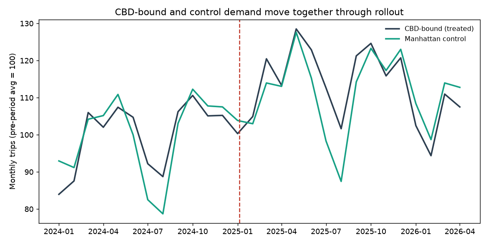
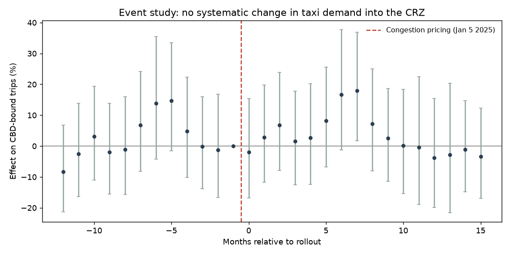
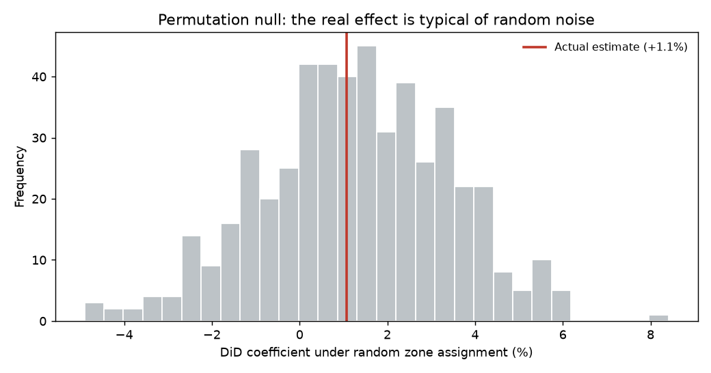

# NYC Congestion Pricing: A Causal Study of Taxi Demand

**Did the Manhattan congestion toll (live Jan 5, 2025) cut taxi demand into the
Central Business District? Using 95 million-plus trip records and
difference-in-differences, the answer is no — and that itself is the finding.**

> 📊 **Interactive dashboard:** _add your Tableau Public URL here after publishing
> (see [`tableau/DASHBOARD.md`](tableau/DASHBOARD.md))_
> 📓 **Full analysis notebook:** [`analysis/did.ipynb`](analysis/did.ipynb)

---

## TL;DR

The popular narrative said congestion pricing would cut trips into the CBD by
20–25%. For yellow and green taxis, the data shows **no measurable effect**:

| Estimate | Result |
|---|---|
| **Headline DiD** (CBD-bound demand, log trips) | **+0.9%**, 95% CI **[−2.0%, +4.0%]**, p = 0.54 |
| Average CBD toll actually charged | **$0.74** per CBD-bound trip |
| Zone fixed-effects DiD (Manhattan, weighted, clustered) | +1.1%, p = 0.61 |
| Permutation test (random treatment reassignment) | actual indistinguishable from null, p = 0.68 |
| Parallel-trends pre-test | not rejected (p = 0.10) |

The toll is real but small (~$0.75/trip), so metered-taxi demand barely moves. The
large behavioural effects of congestion pricing fell on **private vehicles**,
which face the full daily toll, not on taxis that pass through a flat per-trip fee.
A clean null, precisely estimated, that overturns a confident prior.



---

## Problem statement

On **January 5, 2025**, New York became the first U.S. city to charge a congestion
toll for entering a Central Business District — the **Congestion Relief Zone
(CRZ)**, Manhattan south of 60th St. This study asks a causal question: *holding
seasonality and city-wide trends fixed, did the toll change taxi demand for trips
into the zone?*

Identification is difference-in-differences:

- **Treated** — trips dropping off **inside the CRZ** ("CBD-bound").
- **Control** — trips dropping off in **Manhattan north of 60th St**, just outside
  the zone. Same service mix, same borough, adjacent geography, so the control is a
  credible counterfactual (unlike outer-borough trips, whose taxi volumes follow
  very different secular trends — shown explicitly in the robustness section).

## Data

- **NYC TLC Trip Record Data** — yellow + green taxi, **Jan 2024 → latest release**
  (currently through April 2026; 12 pre-treatment and 16+ post-treatment months).
- Loaded directly from the TLC parquet releases with **DuckDB** (SQL over remote
  parquet, no warehouse needed).
- **A note on BigQuery:** the master plan called for
  `bigquery-public-data.new_york_taxi_trips`, but that public dataset **stops at
  2023** and contains none of the post-treatment period. The study therefore runs
  on the TLC parquet files; [`sql/bigquery_preperiod_xcheck.sql`](sql/bigquery_preperiod_xcheck.sql)
  reproduces the same panel logic in BigQuery for the 2022–2023 baseline as a
  second-engine cross-check.
- The pipeline **auto-discovers the latest available month**, so re-running keeps
  the study current.

### The Congestion Relief Zone, derived from data (not hand-listed)

When the toll launched, TLC added a `cbd_congestion_fee` column to every trip. The
fee applies to any taxi trip touching the CRZ, so a **pickup zone where nearly
every trip is charged must lie inside the zone**. Grouping pickups by zone produces
a sharp separation — 38 Manhattan zones at ~95–99% fee incidence, then a cliff at
the 60th St boundary (Lincoln Square 0.58, Central Park 0.58, Upper East Side South
0.51). Those 38 zones *are* the CRZ, recovered empirically and reproducibly rather
than from a hand-typed list. See [`src/zones.py`](src/zones.py) and
[`sql/01_derive_crz_zones.sql`](sql/01_derive_crz_zones.sql).

## Methodology

1. **Daily panel** by destination group and by pickup zone
   ([`sql/02_daily_panel.sql`](sql/02_daily_panel.sql), [`src/build_panel.py`](src/build_panel.py)).
2. **Headline DiD** — `log(trips) ~ treated*post + day-of-week + month`, HC1-robust.
3. **Event study / dynamic DiD** — treatment × month-relative-to-rollout dummies,
   baseline = month before launch; traces pre-trends and post dynamics.
4. **Zone two-way fixed-effects DiD** — zone + calendar-month FE, trip-weighted,
   clustered by borough.
5. **Robustness** — parallel-trends test, placebo treatment dates, alternate
   control groups, and a **permutation test** that reassigns treatment across zones
   to build a design-based null. ([`src/did.py`](src/did.py), [`src/robustness.py`](src/robustness.py))

All coefficients are produced by the code in this repo. No numbers are hand-entered.

### Event study

Coefficients scatter around zero before and after rollout — parallel pre-trends,
no post-treatment break.



### Validating the design

The real estimate sits squarely inside the permutation null: reassigning treatment
to random zones produces effects just as large.



## Key result and interpretation

Congestion pricing did **not** reduce taxi trips into the CBD. The finding is
stable across the choice of control group, the estimator, weighting, and
design-based inference. The mechanism is economic: a $0.75 per-trip surcharge is a
small fraction of a typical CBD fare, so demand is inelastic to it, while taxis may
also benefit from faster trips in a less congested zone. The policy's intended
behavioural effect — fewer vehicles entering the CBD — operated on **private cars
paying the full daily toll**, not on metered taxis.

## Limitations

- **Scope:** yellow + green taxis only. Rideshare (HVFHV / Uber-Lyft) faces a
  larger **$1.50** per-trip CBD fee and is the natural next step; the same code
  path supports it via `config.yaml` (`services`). HVFHV files are multi-GB/month
  and were out of scope for this pass.
- **Pre-trends:** the parallel-trends pre-test is not rejected (p = 0.10), but
  placebo dates show modest seasonal wiggle (±6–7%). The treatment-period estimate
  is *smaller* than that placebo noise, which strengthens rather than weakens the
  null, but the control is not perfectly parallel.
- **Outcome:** trip counts and fares, not vehicle-miles, emissions, or revenue.
- **External validity:** an effect on taxis says nothing about private-vehicle
  entries, where the headline congestion-pricing reductions occur.

## Reproduce

```bash
pip install -r requirements.txt

# The derived daily panels are committed, so you can rerun the analysis directly:
make analyze figures        # DiD + robustness + figures from committed panels
make test                   # pytest

# Or rebuild everything from the raw TLC data (~1.8 GB download on first run):
make reproduce              # data -> zones -> panel -> analyze -> figures
```

## Repository layout

```
config.yaml                 # all study parameters (dates, services, CRZ threshold)
sql/                        # DuckDB extraction + BigQuery cross-check
  01_derive_crz_zones.sql   #   recover the CRZ from cbd_congestion_fee
  02_daily_panel.sql        #   daily DiD panel (destination + pickup-zone grains)
  03_validate_cbd_fee.sql   #   sanity-check treatment labels vs the real toll
  bigquery_preperiod_xcheck.sql
src/                        # pipeline
  download.py build_panel.py zones.py did.py robustness.py viz.py geo.py common.py
analysis/did.ipynb          # narrative notebook with rendered tables and charts
data/                       # committed: derived panels, CRZ zones, Tableau exports
results/                    # did_results.json, robustness.json, event_study.csv
figures/                    # event study, trends, permutation null
tableau/DASHBOARD.md        # step-by-step Tableau Public build guide
tests/                      # pytest sanity checks (run in CI)
```

## Tech

Python · DuckDB · pandas · statsmodels · plotly · matplotlib · pytest · GitHub Actions
